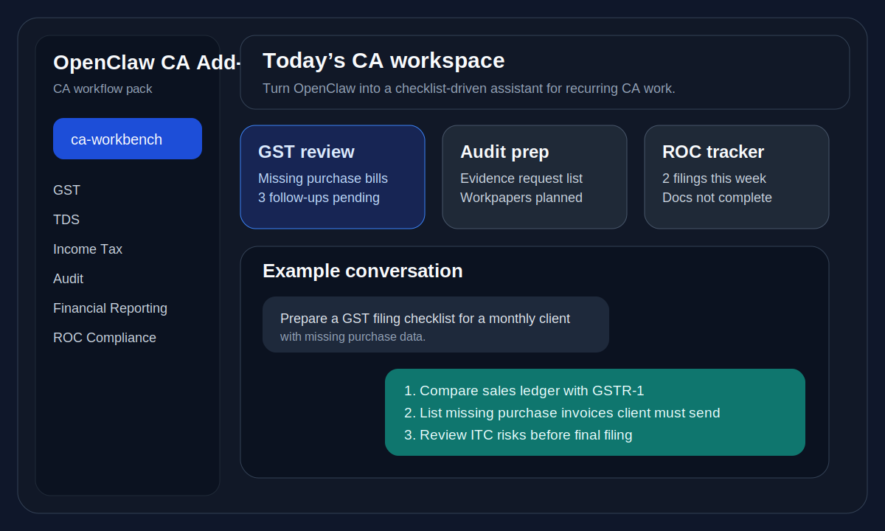
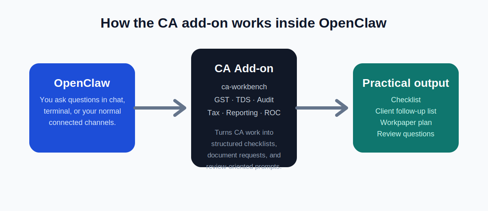

# CAClaw

<p align="center">
  
</p>

<p align="center">
  <strong>Chartered Accountant add-on for OpenClaw</strong><br />
  Turn OpenClaw into a more practical assistant for GST, TDS, audit, income tax, financial reporting, and ROC work.
</p>

<p align="center">
  
  
  
  
</p>

---

## Table of contents

- [What CAClaw is](#what-caclaw-is)
- [Who CAClaw is for](#who-caclaw-is-for)
- [What CAClaw helps with](#what-caclaw-helps-with)
- [Quick visual preview](#quick-visual-preview)
- [What is included](#what-is-included)
- [Important boundary](#important-boundary)
- [Before you install](#before-you-install)
- [How to install from GitHub into OpenClaw](#how-to-install-from-github-into-openclaw)
- [How to check that it is installed correctly](#how-to-check-that-it-is-installed-correctly)
- [How to use CAClaw in OpenClaw](#how-to-use-caclaw-in-openclaw)
- [Example prompts for a Chartered Accountant](#example-prompts-for-a-chartered-accountant)
- [Documentation inside this repository](#documentation-inside-this-repository)
- [Troubleshooting](#troubleshooting)
- [Repository and OpenClaw docs](#repository-and-openclaw-docs)

---

## What CAClaw is

CAClaw is a **Chartered Accountant add-on for OpenClaw**.

It helps OpenClaw support recurring professional work such as:

- GST working and review
- TDS working and follow-up
- income-tax preparation support
- audit planning and evidence tracking
- financial reporting checklists
- ROC and company-law compliance support

This is **not** a separate app.
It is an **add-on plugin** you install into OpenClaw.

So the model is simple:

- **OpenClaw** remains the main product
- **CAClaw** is the CA specialization layer
- a CA can use OpenClaw in a more structured, practical way

---

## Who CAClaw is for

CAClaw is for:

- individual Chartered Accountants
- CA firms
- article assistants working under CA supervision
- teams that want reusable checklists, prompts, review structures, and follow-up workflows

If you already use OpenClaw and want it to feel more useful for real CA work, CAClaw is for you.

---

## What CAClaw helps with

### GST
- return-preparation checklists
- reconciliation support
- working-paper structure
- client information request lists
- review questions before filing

### TDS
- deduction review support
- due-date follow-up lists
- checklist-based preparation
- missing-data request lists

### Income Tax
- preparation checklists
- document collection lists
- return review prompts
- case-wise work organization

### Audit
- audit-type routing through a main audit branch
- statutory audit support through a dedicated statutory-audit branch
- planning support
- evidence request lists
- workpaper preparation structure
- review and follow-up prompts

### Financial Reporting
- close checklists
- statement preparation support
- schedule and note preparation scaffolds
- review structure for reporting work

### ROC and Compliance
- filing-readiness checklists
- compliance document request lists
- recurring ROC support structure
- corporate-compliance task guidance

---

## Quick visual preview

### 1. OpenClaw with CAClaw enabled

<p align="center">
  
</p>

### 2. How CAClaw works inside OpenClaw

<p align="center">
  
</p>

---

## What is included

This repository currently includes:

- `ca-workbench` — main CA router skill
- `ca-gst`
- `ca-tds`
- `ca-income-tax`
- `ca-audit`
- `ca-audit-statutory`
- `ca-financial-reporting`
- `ca-roc-compliance`
- supporting CA docs
- CA-specific assets and reference material

---

## Important boundary

CAClaw is designed to **assist** CA work, not to replace review or sign-off.

It does **not** claim to:

- file returns automatically
- guarantee statutory correctness
- replace professional judgment
- replace audit judgment
- replace legal review

Think of it as a well-organized CA assistant layer inside OpenClaw.

---

## Before you install

Before using CAClaw, you need:

1. **OpenClaw installed and working**
2. access to your terminal on the system where OpenClaw runs
3. Git installed if you want to clone this repository directly from GitHub

First confirm OpenClaw is available:

```bash
openclaw --help
```

---

## How to install from GitHub into OpenClaw

This is the simplest GitHub-based setup.

### Step 1: clone this repository

```bash
git clone https://github.com/shaileshopenclaw/CAClaw.git
cd CAClaw
```

### Step 2: install CAClaw into OpenClaw

From inside the cloned folder, run:

```bash
openclaw plugins install .
```

This tells OpenClaw to install the plugin from the current local folder.

### Step 3: enable CAClaw

```bash
openclaw plugins enable caclaw
```

### Step 4: inspect the install

```bash
openclaw plugins inspect caclaw
```

You should see the plugin metadata and the CA skill pack.

### Step 5: restart the OpenClaw gateway

```bash
openclaw gateway restart
```

After restart, CAClaw is available inside OpenClaw.

### Optional: link mode for a working checkout

If you want OpenClaw to use this folder directly without copying it:

```bash
git clone https://github.com/shaileshopenclaw/CAClaw.git
cd CAClaw
openclaw plugins install -l .
openclaw plugins enable caclaw
openclaw plugins inspect caclaw
openclaw gateway restart
```

This is useful if you want to keep updating your local checkout.

---

## How to check that it is installed correctly

Run:

```bash
openclaw plugins list
openclaw plugins inspect caclaw
```

You should see:

- plugin id: `caclaw`
- the plugin listed in OpenClaw
- CA skills available through the plugin

---

## How to use CAClaw in OpenClaw

Start with the main CA router skill:

- `ca-workbench`

Then use the specific workflow skills when needed:

- `ca-gst`
- `ca-tds`
- `ca-income-tax`
- `ca-audit`
- `ca-audit-statutory`
- `ca-financial-reporting`
- `ca-roc-compliance`

A simple practical approach is:

1. open OpenClaw
2. tell it the work area
3. ask for a checklist, preparation plan, document request list, or review structure
4. use the output as your working draft
5. review professionally before final use

---

## Example prompts for a Chartered Accountant

### GST
- "Prepare a GST filing checklist for a monthly client with missing purchase data."
- "Give me a GST reconciliation workplan for this month."

### TDS
- "Create a TDS deduction review checklist for salary and contractor payments."
- "Draft a missing-information follow-up list for TDS working."

### Income Tax
- "Give me an income-tax preparation checklist for a proprietor client."
- "Make a document request list for return preparation."

### Audit
- "Prepare an audit evidence request list for a trading company."
- "Give me a workpaper preparation checklist for statutory audit planning."

### Financial Reporting
- "Create a year-end financial reporting checklist for a small company."
- "Give me a schedule preparation structure for finalization work."

### ROC / Compliance
- "Prepare an ROC compliance checklist for a private limited company."
- "Make a filing-readiness checklist for corporate compliance review."

---

## Documentation inside this repository

If you want more detail after the basic install, start here:

- [`docs/README.md`](docs/README.md) — simple guide to the documentation set
- [`docs/workflow-entrypoints.md`](docs/workflow-entrypoints.md) — where a CA should start using CAClaw
- [`docs/workflow-pack-structure.md`](docs/workflow-pack-structure.md) — how the CA workflow pack is organized
- [`docs/client-workspace-model.md`](docs/client-workspace-model.md) — how to think about client-wise and compliance-wise organization
- [`docs/integration-rails.md`](docs/integration-rails.md) — where future integrations should go
- [`docs/automation-governance.md`](docs/automation-governance.md) — boundaries for higher-trust automation

---

## Troubleshooting

Try these checks:

```bash
openclaw plugins inspect caclaw
openclaw plugins list
openclaw plugins doctor
```

Then restart the gateway again:

```bash
openclaw gateway restart
```

If OpenClaw still does not load CAClaw, uninstall and reinstall from the cloned folder.

---

## Repository and OpenClaw docs

GitHub repository:

- https://github.com/shaileshopenclaw/CAClaw

OpenClaw plugin install docs:

- https://docs.openclaw.ai/cli/plugins
- https://docs.openclaw.ai/tools/plugin
